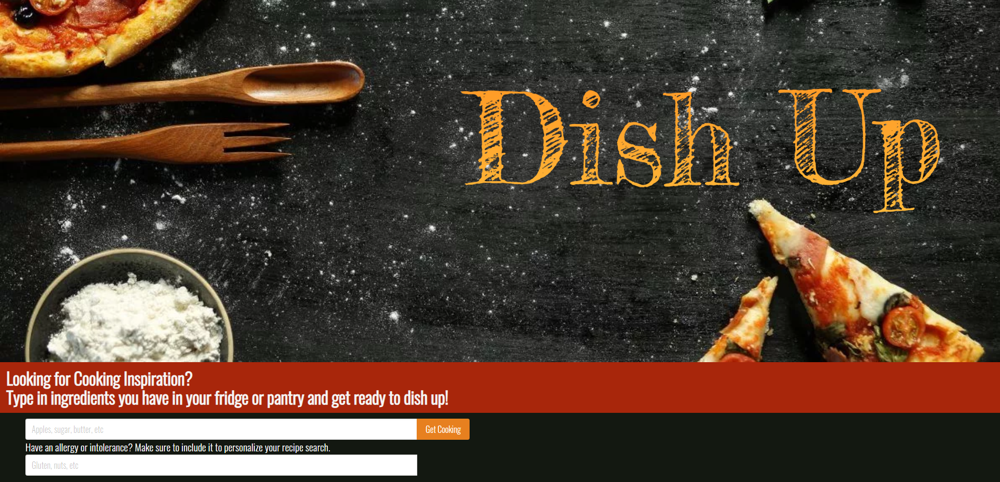

Dish Up - Team Cookbook's take on the Pantry Raid!

Not really sure what to make with the items you currently have in your fridge or pantry? Dish Up allows users to search through thousands of recipes with the help of the robust Spoonacular API.  

A user is presented on the main page with the search bar to enter in as many, or as little, ingredients to filter through Spoonacular's database and present the user with the results of recipes featuring the specified ingredients. The user will also find a second search bar in which to optionally enter food allergies or intolerances that allows the user to simultaneously filter out recipes that may contain said food allergy. 

Technologies Used:
HTML, Bulma CSS Framework, JavaScript, jQuery, Local Storage, Spoonacular API, Figma and Images

Challenges: Learning Figma, using Local Storage, Blocking Recipes based on Allergies, Searching by ingredients, and adding Images.

Things to add: Readable Saved Recipe List, Toggle Switches, 